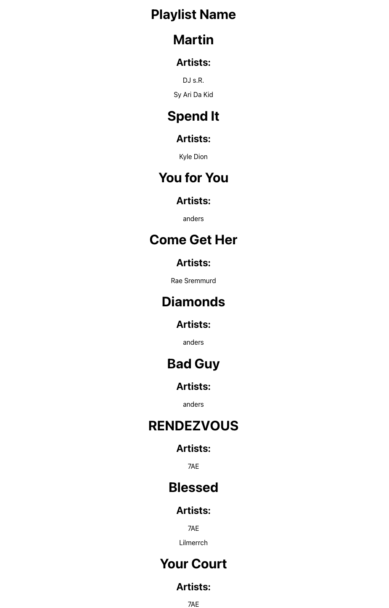
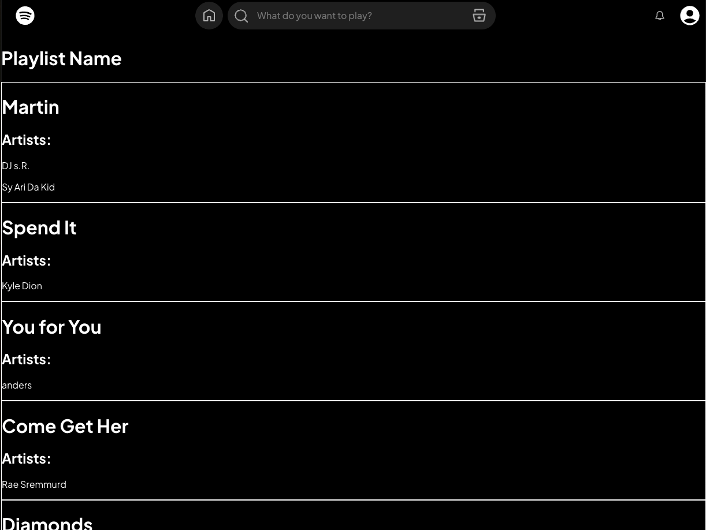

# Spotify to Youtube

This project is a React application that allows you to fetch songs from your spotify account playlists and then find a song on YouTube so you can download it if you have youtube premium.

# Goals

Refresh memory with HTML tags and vanilla CSS. Learn Java and Springboot for the backend.

## Available Scripts

In the project directory, you can run:

### `npm start`
Open [http://localhost:3000](http://localhost:3000) to view it in the browser.

### `npm test`

### `npm run build`

### `npm run eject`

## Spotify API
https://developer.spotify.com/documentation/web-api/tutorials/getting-started

### Access Token Request
curl -X POST "https://accounts.spotify.com/api/token" \
     -H "Content-Type: application/x-www-form-urlencoded" \
     -d "grant_type=client_credentials&client_id=your-client-id&client_secret=your-client-secret"

## Credits
Spotify Icon by Icons8 https://icons8.com/icon/11116/spotify

## States 
Just some SS to keep track of project state

### V1

### V2
